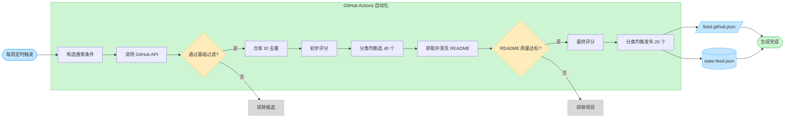
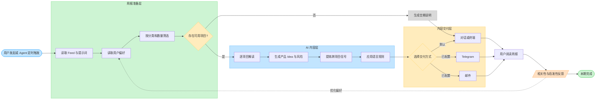

# GitHub Product Ideas 产品流程

本文档展示 GitHub Product Ideas 的两条核心链路：中央 Feed 生产和用户周报消费。流程图
基于当前已完成的 MVP，不把尚未实现的能力画成已经上线的功能。

## 1. 流程边界

| 层级 | 主要职责 | 当前状态 |
| --- | --- | --- |
| 中央 Feed 层 | 搜索、过滤、评分、README 判断、发布和去重 | GitHub Actions 已自动化 |
| 周报准备层 | 读取 Feed、提示词和用户偏好，确定本期项目 | 脚本已实现，调用后自动执行 |
| AI 内容层 | 项目解读、产品 Idea、风险提示和跨项目信号 | 需要 Agent 或持续 LLM 环境触发 |
| 交付层 | 对话、终端、Telegram 或邮件 | 终端已验证，外部渠道待配置 |
| 反馈层 | 相关性评价、收藏、不感兴趣和继续研究 | 尚未产品化 |

## 2. 中央 Feed 生产流程

这一流程负责从 GitHub 的大量公开项目中，稳定生成最多 20 个可供周报使用的结构化项目。
整个绿色区域由 GitHub Actions 自动执行。

### 关键产品判断

- **为什么先过滤再评分**：避免把 API 请求和 README 阅读资源浪费在明显无效的项目上。
- **为什么分两阶段评分**：先用元数据缩小候选范围，再加入 README 质量信号，兼顾效率
  与内容可信度。
- **为什么做分类均衡**：防止单一热门领域占满榜单，让周报保留发现不同产品机会的能力。
- **为什么保存状态文件**：为历史去重和后续的变化趋势判断提供基础数据。

## 3. 用户周报消费流程

这一流程负责把结构化 Feed 转换成用户可以阅读的产品周报。绿色区域是确定性脚本，蓝色
区域需要 LLM，黄色区域表示交付能力尚未全部验证。

### 当前自动化边界

1. `prepare-digest.js` 可以自动读取和筛选项目，但输出仍是提供给 AI 的结构化输入。
2. 项目解读和产品 Idea 生成需要 LLM，不能直接把准备阶段 JSON 当成周报正文。
3. 终端输出已经通过真实周报验收；Telegram 和邮件需要用户密钥，尚未真实外发。
4. 用户反馈目前通过对话收集，尚未形成收藏、评分或“不感兴趣”等产品功能。

## 4. 核心数据流

| 数据 | 产生位置 | 主要消费者 | 作用 |
| --- | --- | --- | --- |
| `feed-github.json` | 中央 Feed 层 | 周报准备层 | 保存本期最多 20 个项目及其公开信息 |
| `state-feed.json` | 中央 Feed 层 | 下一次 Feed 运行 | 保存历史推荐和候选快照 |
| 用户配置 | 用户或 Agent | 周报准备层 | 控制语言、分类、数量和交付方式 |
| AI 提示词 | 项目仓库 | AI 内容层 | 约束项目解读、风险和语言规则 |
| 最终周报 | AI 内容层 | 用户和交付层 | 提供项目判断与产品灵感 |
| 用户反馈 | 用户 | 后续推荐机制 | 验证推荐相关性和 Idea 启发性 |

## 5. 关键决策点

### 决策点 A 项目是否进入 README 阶段

依据公开元数据、时间、活跃度、分类匹配和基础质量进行初筛。该决策的目标是控制 API
请求成本，不是直接判断项目最终价值。

### 决策点 B 项目是否进入最终 Feed

综合 README 可读性、安装与用法信息、Demo、文档和元数据后排序，并进行分类均衡。
内部评分只用于筛选，不向最终用户展示，也不构成安全或商业价值结论。

### 决策点 C 是否生成本期周报

当没有项目符合用户选择的分类时，产品应明确输出空期说明，而不是为了凑数加入无关项目。

### 决策点 D 使用哪种交付方式

默认使用对话或终端，避免在没有配置密钥时触发外部发送。Telegram 和邮件只有在用户明确
选择并完成配置后才执行。

## 6. 下一步流程优化

- 在用户阅读后增加“相关”“有启发”“继续研究”和“不感兴趣”反馈。
- 将用户反馈写入用户级历史，而不是只依赖中央去重状态。
- 为 Feed 生成、AI 周报和外部发送分别增加失败状态和重试提示。
- 在持续 LLM 环境可用后，将个人周报消费流程从按需触发升级为每周自动运行。
